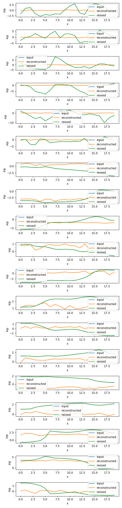

# Cycling Recognition
In order to check that users perform cycling and do not try to cheat by using another type of transportation (walking, scooter, car), we analyze signals coming from accelerometers, gyroscopes and magnetometers located in their phones. These signals are helpful to define movement patterns performed by users.

## Methodology
Training a classification model based on neural networks capable of identifying cycling requires large amounts of data. Moreover, these data should be manually annotated, meaning that for each sequence of signals a label (cycling/walking/etc.) should be provided.

In this project, we frame the problem as anomaly detection in order to partially overcome the need to obtain large amounts of labeled data. Specifically, we employ so-called autoencoders that, first, extract lower dimensional vector representations of data, and, later, aim to reconstruct the input signals from the obtained representations [1]. During training, the model is trained by minimizing the reconstruction loss (mean-squared error in our case) between the original input and the obtained reconstruction [2]. Therefore, in this case, the input is used as the ground truth label, hence, manual annotations are not required.

Autoencoders are simple and lightweight, yet effective models to create lower-dimensional representations of input signals. What is more, they can be used in an anomaly detection settings. Namely, when autoencoders are pre-trained on data coming from a certain distribution (cycling activity in our case), they typically fail to reconstruct inputs coming from different distributions [3]. Finally, STEPN's project's anti-cheating system exploits autoencoders to recognize non-walking activity [4].

While the autoencoder is a framework for representation learning, different neural network architectures could be trained within the autoencoder. Given that architectures based on Convolutional Neural Networks (CNNs) have shown decent performance on the activity recognition problem in the related literature [5], we exploit them in our project. Specifically, for the first prototype, our autoencoder is based on CNN containing three layers. The bottleneck consist of 2 fully-connected layers. Finally, the signal is reconstructed using Transposed-CNN of the symmetric architecture. The model is implemented using [Pytorch](https://pytorch.org/) and [Pytorch Lightning](https://www.pytorchlightning.ai/) in `models/cae.py`.

The model hyperparameters, such as number of CNN channels, size of vector representations, learning rate, etc. are defined in YAML files in `/config`.

## Implementation details and scripts
### Environment
Python version: `3.9.3`

The conda environment can be created and activated as follows:
```
$ conda env create -n cycling_rec -f environment.yml 
$ conda activate cycling_rec
```

### Pre-processing
In this project, we collected an initial dataset comprising of 6 subjects performing cycling, walking and scooter riding with phones located in different positions (pocket, bag, etc.). The dataset can be downloaded via the following [link](https://drive.google.com/file/d/1agNfAXbtUVwQKIOM_nBBb9gag6gPkbB8/view?usp=sharing). The data has been collected on 20HZ frequeny and consists of accelerometer, gyroscope, magnetometer and orientation signals. The autoencoder operates on short chunks of data, meaning that long ride sequence should be sampled into shorted time-windows. Moreover, we split data into training and test splits. The training set is used to train the autoencoder which is later evaluated on the test split.

In order to run sampling and splitting of data, use the following command:
```
$ python preprocessing.py --data_path ./data/ride_data/ --destination_path ./sampled_data/sec1_ovr0_50hz_test_volodymyr/ --test_sub volodymyr --get_norm_vals
```

The script splits all data from subject `volodymyr` and `yaroslav` (including cycling)  and non-cycling sequences from other subjects into the test set, and cycling sequences from all the remaining subjects with cycling activity into the train set. We only use cycling activity for training as we want our autoencoder to successfully reconstruct only . The time-windows are sampled into 1 second time-windows with no overlapping (default parameters). You can specify custom length of time window in seconds using `--len_tw_sec` argument and overlapping ratio could be set with `--overlap_ratio`. Argument `--get_norm_vals` computes and saves mean and std per channel based on the train set for further normalization of data. The trained autoencoder  model is exported in the `onnx` format and can later be used in the app for the real-time inference.

### Training and testing
The autoencoder training and testing can be launched using:
```
python training.py --data_path ./sampled_data/v1_sec1_ovr0_20hz_test_volodymyr_yar_19ch_test/ --experiment_config config/cae/cae_19ch_20hz.yml --model_weights_path ./model_weights --num_workers 8 --export_onnx 
```
By default some results (train/test reconstructions and test loss distribution for cycling and non-cycling activities) will be saved to `./results`; saved model parameters -- to `./model_weights`; lightning logs -- to `./logs`.

## Results
### Reconsruction ability
During training we evaluate how the autoencoder model learns to reconstruct the input signals. Below we attach some reconstructions of cycling activity time-windows produced by models of different complexity after 1st, 10th and 25th epoch of training, respectively.

Complex model `./configs/cae_19ch_20hz_large.yml`:
<p>


</p>

Simplified model `./configs/cae_19ch_20hz.yml`:
<p>



</p>

It is clearly seen that the simplified model learns patterns worse than the complex one. In turn, the complex one is much more heavy (100+ MB vs ~2MB) and slow.

### Performance on test sets:
We also assess  our models on the test sets that we held out beforehand. In this case, we have cycling activities of other people using other devices, and this may affect the reconstruction rates of the model. For this experiment, we have also trained a simple model that only uses accelerometers and gyroscopes (6 sensor channels, overall) to see if we can further simplify the models. 

In our current dataset, we have 3 types of activities: cycling, walking and scooter riding. As described previously, we train the models on all the users performing cycling apart from volodymyr and yaroslav. Later, we test the model on cycling from volodymyr and yaroslav, and all the other activities performed by all users. In the table below, we show the average reconstruction errors per activity with their standard deviations in brackets. Ideally, these should be different for all three types of activities, so that we can set threshold during inference. Additionally, we trained a more simplified model on accelerometers and gyroscopes only (this can later make inference faster).

Activity | Complex model | Simple model | Simple model (acc + gyro)
--- | --- | --- | ---
Cycling | 0.29 (0.15) | 0.63 (0.42) | 0.94 (1.01)
Scooter Riding | 0.25 (0.24) | 0.55 (0.73) | 1.01 (1.77)
Walking | 0.64 (0.27) | 2.04 (0.99) | 5.03 (2.86)

On the one hand, reconstruction errors rates for the simplified models are larger for all activites including cycling, on the other hand there is a bigger difference between cycling and other activities for simple models. Also, there is still a clear difference between cycling and walking. As for scooter riding and cycling, at this stage, it is quite challenging to distinguish between them and this should be addressed in the next stages of the project (discussed below). 

## Future Work
We are planning to take the following steps in order to improve the current prototype of the anti-cheating system:

* Collect more cycling and non-cycling data taking into account the following biases:
	- Phone positions: pocket, bag, bike stand
	- Cheating types: cars, different types of scooters, e-bikes (that case might be especially challenging)

* Explore, what input channels and time-windows sizes are the most suitable for cycling recognition. This can improve the quality and efficiency (runtime) of the model during inference. We should find a good trade-off between reconstruction capacity and computational complexity of a model.

* Try to solve the task as classification (not as anomaly detection), if enough labeled data is collected.

* Find ways to fuse data coming from other useful modalities recorded at different frequencies (such as GPS tracking, speed, etc.) into the system. 

## References
[1] https://en.wikipedia.org/wiki/Autoencoder

[2] https://en.wikipedia.org/wiki/Mean_squared_error

[3] https://www.analyticsvidhya.com/blog/2021/05/anomaly-detection-using-autoencoders-a-walk-through-in-python/

[4] https://stepnofficial.medium.com/smac-stepn-model-for-anti-cheating-a36bc1d6ecb0

[5] Haresamudram, Harish, David V. Anderson, and Thomas Plötz. "On the role of features in human activity recognition." Proceedings of the 23rd International symposium on wearable computers. 2019.